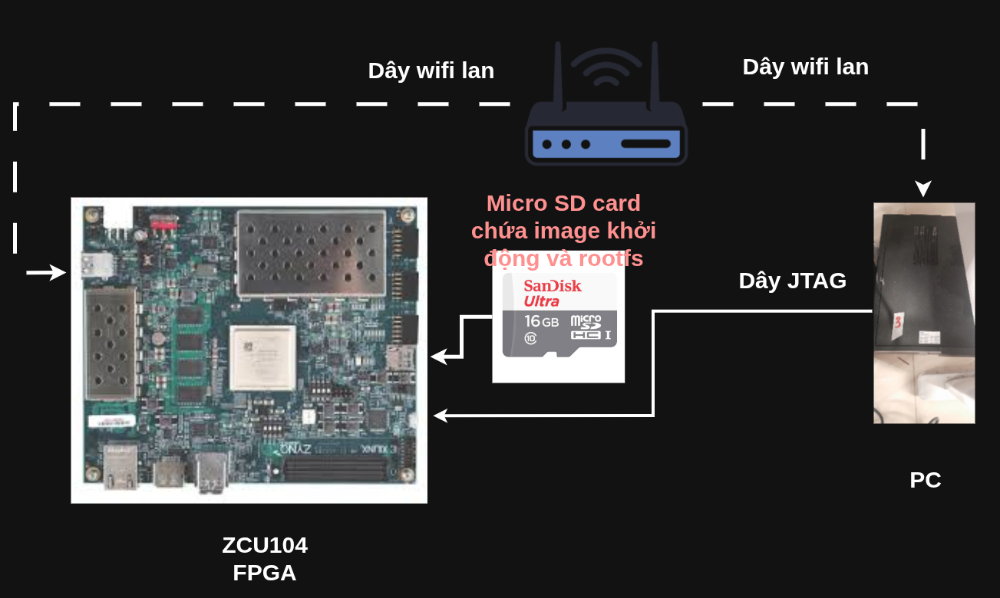

# Hướng dẫn Thiết lập PetaLinux và Tạo Image cho ZCU104

Hướng dẫn này trình bày quy trình đầy đủ để thiết lập môi trường PetaLinux, tạo Image khởi động và hệ điều hành Linux (với rootfs Debian) cho bo mạch ZCU104.

> **Lưu ý quan trọng**: Hướng dẫn này được thực hiện với sự hỗ trợ từ anh **Phan Hoài Luân** - AISeQ Lab.
>
> **Nguồn tham khảo**: [https://github.com/datnduit/Level_1_KV260_FPGA/tree/main](https://github.com/datnduit/Level_1_KV260_FPGA/tree/main)

---

## I. Thiết lập Môi trường PetaLinux

Phần này mô tả các bước từ việc xuất thiết kế phần cứng trong Vivado đến việc xây dựng project PetaLinux.

### 1. Xuất file Phần cứng (`.xsa`) từ Vivado

Sau khi hoàn tất Block Design và **Generate Bitstream** thành công trong Vivado:

1.  Mở menu: **File → Export → Export Hardware**.
2.  Đánh dấu chọn vào ô **Include bitstream**.
3.  Nhấn **OK** để xuất file. File `.xsa` (ví dụ: `ZCU104_wrapper.xsa`) sẽ được tạo ra.

### 2. Cài đặt PetaLinux 2022.2

1.  **Tải bộ cài**:
    * Truy cập trang Xilinx và tải về **PetaLinux 2022.2 Installer**:
    * 🔗 [Xilinx Downloads - Archive](https://www.xilinx.com/support/download/index.html/content/xilinx/en/downloadNav/embedded-design-tools/archive.html)

2.  **Cài đặt các gói phụ thuộc (Ubuntu/Debian)**:
    ```bash
    sudo apt-get install tofrodos gawk xvfb git libncurses5-dev tftpd zlib1g-dev zlib1g-dev:i386 \
    libssl-dev flex bison chrpath socat autoconf libtool texinfo gcc-multilib \
    libsdl1.2-dev libglib2.0-dev screen pax libtinfo5 xterm build-essential net-tools
    ```

3.  **Chạy trình cài đặt**:
    ```bash
    # Cấp quyền thực thi cho file .run
    chmod +x petalinux-v2022.2-*.run
    
    # Chạy file cài đặt
    ./petalinux-v2022.2-*.run
    ```
    * Trong quá trình cài đặt, bạn sẽ cần xem qua các điều khoản bản quyền. Dùng `PgUp`/`PgDn` để cuộn, nhấn `q` để thoát và `y` để đồng ý.

### 3. Xây dựng Project PetaLinux

1.  **Thiết lập môi trường PetaLinux**:
    Mỗi khi mở một terminal mới để làm việc, bạn cần source file `settings.sh`:
    ```bash
    source <đường_dẫn_cài_đặt_petalinux>/2022.2/settings.sh
    ```

2.  **Tải BSP (Board Support Package) cho ZCU104**:
    * Tải file BSP cho ZCU104 từ cùng trang download của Xilinx.

3.  **Tạo Project từ BSP**:
    ```bash
    # Tạo project tên là ZCU104_Linux từ file BSP đã tải
    petalinux-create -t project -s <đường_dẫn_tới_file_bsp>/xilinx-zcu104-v2022.2-final.bsp -n ZCU104_Linux
    
    # Di chuyển vào thư mục project
    cd ZCU104_Linux
    ```

4.  **Import file thiết kế phần cứng (`.xsa`)**:
    ```bash
    # Trỏ PetaLinux đến file .xsa đã xuất từ Vivado
    petalinux-config --get-hw-description=<đường_dẫn_tới_file_xsa>
    ```
    Một giao diện cấu hình sẽ hiện lên. Bạn có thể thoát ngay mà không cần thay đổi gì ở bước này.

5.  **Cấu hình Kernel và Device Tree**:
    * **Thiết lập Kernel Boot Arguments**:
        Mở lại giao diện cấu hình: `petalinux-config`
        Điều hướng đến: `DTG Settings ---> Kernel Bootargs`
        * Bỏ chọn `[ ] generate boot args automatically`.
        * Dán chuỗi sau vào `user set kernel bootargs`:
            ```text
            earlycon clk_ignore_unused cpuidle.off=1 root=/dev/mmcblk0p2 rw rootwait uio_pdrv_genirq.of_id=generic-uio
            ```
    * **Thiết lập Root Filesystem trên SD Card**:
        Trong cùng giao diện, điều hướng đến: `Image Packaging Configuration ---> Root filesystem type`
        * Chọn `(X) EXT4 (SD/eMMC/SATA/USB)`.
    * Lưu cấu hình và thoát.

6.  **Chỉnh sửa Device Tree cho driver UIO**:
    Để Linux nhận diện được các IP tự thiết kế trong PL qua driver UIO, hãy chỉnh sửa file `system-user.dtsi`:
    * Đường dẫn: `project-spec/meta-user/recipes-bsp/device-tree/files/system-user.dtsi`
    * Xóa toàn bộ nội dung cũ và thay bằng nội dung sau:
    ```dts
    /include/ "system-conf.dtsi"
    / {
        reserved-memory {
            #address-cells = <2>;
            #size-cells = <2>;
            ranges;
            reserved: buffer@0 {
                no-map;
                reg = <0x8 0x0 0x0 0x80000000>;
            };
        };
    
        amba: axi {
            /* GDMA Channels */
            fpd_dma_chan1: dma-controller@fd500000 { compatible = "generic-uio"; };
            fpd_dma_chan2: dma-controller@fd510000 { compatible = "generic-uio"; };
            fpd_dma_chan3: dma-controller@fd520000 { compatible = "generic-uio"; };
            fpd_dma_chan4: dma-controller@fd530000 { compatible = "generic-uio"; };
            fpd_dma_chan5: dma-controller@fd540000 { compatible = "generic-uio"; };
            fpd_dma_chan6: dma-controller@fd550000 { compatible = "generic-uio"; };
            fpd_dma_chan7: dma-controller@fd560000 { compatible = "generic-uio"; };
            fpd_dma_chan8: dma-controller@fd570000 { compatible = "generic-uio"; };
        };
    
        amba_pl@0 {
            /* Thay đổi địa chỉ @a0000000 và tên MY_IP cho phù hợp với thiết kế của bạn, đúng theo memory map của mpsoc*/
            MY_IP@a0000000 {
                compatible = "generic-uio";
            };
        };
    
        ddr_high@000800000000 {
            compatible = "generic-uio";
            reg = <0x8 0x0 0x0 0x80000000>;
        };
    };
    ```

7.  **Build Project**:
    ```bash
    petalinux-build
    ```
    ⚠️ **Lưu ý**: Quá trình build có thể mất từ 30 phút đến hơn 1 giờ.

---

## II. Chuẩn bị Thẻ nhớ SD Card

Sau khi build thành công, chúng ta sẽ tạo các file khởi động và chuẩn bị thẻ nhớ.

### 1. Đóng gói file Khởi động

Lệnh này sẽ tạo ra file `BOOT.BIN` trong thư mục `images/linux/`.

```bash
petalinux-package --boot --force --u-boot
```

### 2. Phân vùng và Định dạng Thẻ nhớ

Sử dụng thẻ nhớ từ **8GB trở lên**.

1.  **Xác định tên thiết bị của thẻ nhớ**:
    Cắm thẻ nhớ vào máy tính và chạy lệnh:
    ```bash
    sudo fdisk -l
    ```
    Tìm thiết bị có dung lượng tương ứng với thẻ nhớ của bạn (ví dụ: `/dev/sdX`).

    > 🛑 **CẢNH BÁO CỰC KỲ QUAN TRỌNG**: Hãy chắc chắn 100% rằng bạn đã chọn đúng tên thiết bị (ví dụ: `/dev/sdb`, `/dev/sdc`). Nếu chọn nhầm `/dev/sda`, **BẠN SẼ XÓA TOÀN BỘ HỆ ĐIỀU HÀNH TRÊN MÁY TÍNH CỦA MÌNH**. Hãy kiểm tra lại nhiều lần. Trong các lệnh dưới đây, hãy thay `/dev/sdX` bằng tên thiết bị đúng.

2.  **Phân vùng thẻ nhớ**:
    ```bash
    sudo fdisk /dev/sdX
    ```
    Trong giao diện `fdisk`, lần lượt nhập các lệnh sau:
    * `d` (xóa phân vùng cũ nếu có, lặp lại cho đến khi hết)
    * `n` (tạo phân vùng mới) -> `p` (primary) -> `1` (partition 1) -> `Enter` (default first sector) -> `+1G` (kích thước 1GB cho phân vùng BOOT)
    * `n` (tạo phân vùng mới) -> `p` (primary) -> `2` (partition 2) -> `Enter` (default first sector) -> `Enter` (default last sector, dùng toàn bộ phần còn lại)
    * `w` (ghi thay đổi và thoát)

3.  **Định dạng các phân vùng**:
    * Phân vùng 1 (BOOT) định dạng FAT32.
    * Phân vùng 2 (ROOT) định dạng EXT4.
    ```bash
    sudo mkfs.vfat -F 32 -n BOOT /dev/sdX1
    sudo mkfs.ext4 -L ROOT /dev/sdX2
    ```

### 3. Chép File vào Thẻ nhớ

1.  **Mount thẻ nhớ**:
    Hầu hết các hệ điều hành Linux hiện đại sẽ tự động mount thẻ nhớ khi bạn cắm vào. Dùng lệnh `lsblk` để xem các điểm mount:
    ```bash
    lsblk
    ```
    Bạn sẽ thấy output tương tự như sau, hãy tìm đúng đường dẫn mount của bạn:
    ```
    sdb      8:16   1  14.9G  0 disk
    ├─sdb1   8:17   1     1G  0 part /media/username/BOOT
    └─sdb2   8:18   1  13.9G  0 part /media/username/ROOT
    ```
    Trong ví dụ này, điểm mount là `/media/username/BOOT` và `/media/username/ROOT`.

2.  **Chép các file khởi động vào phân vùng BOOT**:
    Các file cần thiết nằm trong thư mục `images/linux/` của project PetaLinux.
    ```bash
    cd <đường_dẫn_project>/ZCU104_Linux/images/linux/
    sudo cp BOOT.BIN boot.scr image.ub /media/username/BOOT/
    ```

3.  **Giải nén RootFS vào phân vùng ROOT**:
    * **Tải Debian RootFS**:
        📥 [arm64-rootfs-debian-bullseye.tar.gz](https://drive.google.com/file/d/1ZcJYuVHpn8ER11nLCjwCUjfc5ykqP0tM/view?usp=sharing)
        > File này chứa hệ điều hành Debian 11 (Bullseye) cho ARM64, có sẵn giao diện XFCE.

    * **Giải nén vào thẻ nhớ**:
        ```bash
        # -C chỉ định thư mục đích để giải nén
        sudo tar -xzf <đường_dẫn_tới_file>/arm64-rootfs-debian-bullseye.tar.gz -C /media/username/ROOT/
        ```

4.  **Chép Kernel Modules**:
    Các module này rất quan trọng để driver (như UIO) hoạt động.
    ```bash
    # Giải nén ramdisk để lấy modules
    cd <đường_dẫn_project>/ZCU104_Linux/images/linux/
    gunzip rootfs.cpio.gz
    mkdir -p temp_rootfs
    cd temp_rootfs
    cpio -i < ../rootfs.cpio
    
    # Chép thư mục modules vào thẻ nhớ
    sudo cp -r lib/modules/* /media/username/ROOT/lib/modules/
    ```

5.  **Unmount thẻ nhớ**:
    ```bash
    sudo umount /dev/sdX1 /dev/sdX2
    ```
    Bây giờ bạn có thể rút thẻ nhớ ra an toàn.

---

## III. Khởi động và Lập trình trên ZCU104

### 1. Thiết lập Phần cứng và Kết nối Serial

1.  Cắm thẻ nhớ đã chuẩn bị vào ZCU104.
2.  Kết nối cáp Micro-USB vào cổng **UART** trên bo mạch và máy tính.
3.  Kết nối cáp Ethernet.
4.  Cắm nguồn và bật công tắc.
    

5.  Sử dụng một trình terminal (ví dụ: `screen`, `minicom`, `putty`) để xem log khởi động.
    ```bash
    # Tìm cổng ttyUSB, có thể là ttyUSB0, ttyUSB1,...
    ls /dev/ttyUSB*
    #Nếu có cả 4 cổng mọi người cẩn phải thử hết
    
    # Kết nối với baudrate 115200
    sudo screen /dev/ttyUSB1 115200
    ```

### 2. Truy cập và Lập trình

1.  Sau khi Linux khởi động, bạn sẽ thấy lời nhắc đăng nhập.
2.  **Kiểm tra địa chỉ IP** của bo mạch:
    ```bash
    froifonig
    
    # Nếu lệnh trên lỗi hay thử với lệnh dưới, có thể cần với sudo
    ifconfig
    
    # Hoặc trên các hệ thống mới hơn
    ip a
    ```
    Tìm địa chỉ IP trong output, ví dụ: `inet 192.168.1.10`.

3.  **Kết nối qua SSH** từ máy tính của bạn:
    Sử dụng SSH để làm việc trên bo mạch một cách tiện lợi hơn.
    ```bash
    ssh debian@<địa_chỉ_IP_của_ZCU104>
    ```

4.  **Biên dịch và chạy code C/C++**:
    Bây giờ bạn có thể chuyển file mã nguồn của mình (ví dụ, qua `scp`) vào thư mục `/home/debian/` trên ZCU104, sau đó biên dịch và chạy trực tiếp trên bo mạch.

---

## Liên hệ và Cảm ơn

Mọi thắc mắc, vui lòng liên hệ:

* **Nhóm EDABK**:
    * Đặng Công Bách
    * Nguyễn Thành Trung
* **Tác giả hướng dẫn**: Anh **Phạm Hoài Luân**
    * **Facebook**: [https://www.facebook.com/pham.luan.921/](https://www.facebook.com/pham.luan.921/)
    * **Email**: [luanph@uit.edu.vn](mailto:luanph@uit.edu.vn)

Một lần nữa, em xin chân thành cảm ơn sự hướng dẫn tận tình của anh Phạm Thành Luân đã hỗ trợ nhóm thực hiện project này.
